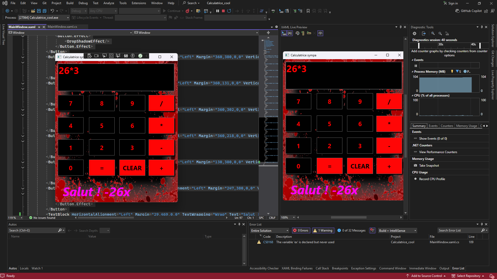

# Fuck la calculatrice windows, utilisez la mienne




## Installation
1. **Clone le repo**
   ```sh
   git clone https://github.com/ton-utilisateur/nom-du-repo.git
   ```
2. **Ouvre le projet dans Visual Studio**
3. **Compile et exécute !**

## Bug, proposition et aide
Si ta trouver un bug ou ta besoin d'aide pour installer, ecrit moi sur ????

## Améliorations et aide
Si ta trouvé un bug, besoin d'aide pour l'installation, ou une idée de nouvelle fonctionnalité, écris-moi sur ????

## PLUS DE FONCTIONNALITES A VENIR, RESTEZ BRANCHES !

## Fait avec
- **C#** (WPF)
- **.NET Framework**
